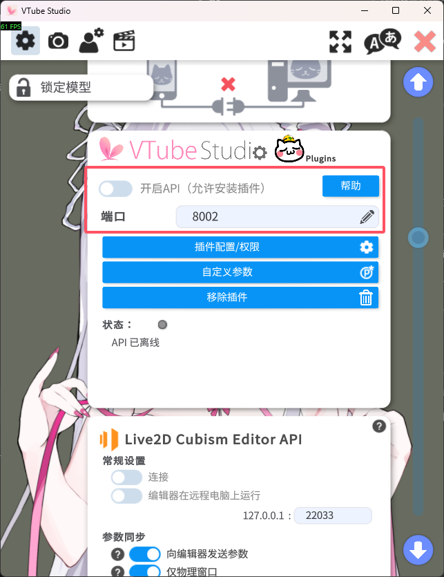
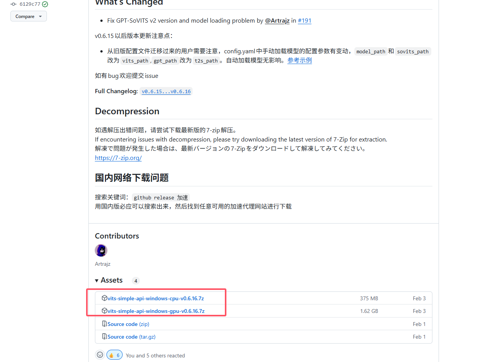

# VTS Face Control Plugin

一个为 VTube Studio 开发的插件，旨在与[Nekro-Agent](https://github.com/KroMiose/nekro-agent)连接通过自动化、富有表现力的动画和直播互动功能，让您的虚拟形象栩栩如生。

## ✨ 功能特性

- **自动空闲动画**:
  - **眨眼**: 模拟自然的眨眼动作。
  - **呼吸**: 实现平滑的呼吸起伏效果。
  - **身体摇摆**: 身体和头部会进行自然的轻微摇摆。
  - **嘴部表情**: 随机切换微笑和嘴型，让表情更丰富。
- **Bilibili 直播集成**:
  - 监听直播间弹幕和消息。
  - 可配置通过弹幕触发连接到[Nekro-Agent](https://github.com/KroMiose/nekro-agent)的LLM模型交互。
- **文本转语音合成**:
  - 根据LLM给出的文本，合成对应的音频并播放，并同时控制模型嘴型进行匹配。
  - 在网页上显示对应的字幕。
- **API 控制**:
  - 提供 WebSocket API，允许其他程序触发动作，如播放动画、改变表情、说话等。

## 🚀 部署指南

### 1. 先决条件

在开始之前，请先下载所需要的内容：

- [打包好的VMC控制端](https://github.com/zxjwzn/vts_face_control_plugin/releases)
- [Nekro-Agent](https://github.com/KroMiose/nekro-agent)
  - **请自行阅读文档安装Nekro-Agent**
- [VTube Studio](https://store.steampowered.com/app/1325860/VTube_Studio/)
  - **重要**: 请在 VTube Studio 中启动 API，并允许插件连接。如图所示
  
- [vits-simple-api](https://github.com/Artrajz/vits-simple-api/releases)
  - 在release中下载你所需要的版本 如图所示(截止到文档编写最新版为v0.6.16) 模型文件请自行搜索下载
  
### 2. 安装与配置

#### 2.1 解压目录结构

下载完成后，将 `vts_face_control_plugin.zip`（或同名压缩包）解压到任意文件夹。解压后的根目录应 **至少** 包含以下三个条目：

```
.
├── data/                 # 运行期生成的资源与配置
├── ffmpeg/               # 内置 ffmpeg / ffplay 可执行文件
└── vts_model_control.exe # 主程序
```

> 若缺少其中文件，请重新下载或检查杀毒软件是否误删。

#### 2.2 修改配置文件

程序首次启动时会在 `data/configs/` 目录下生成 `vts_model_control.yaml`。该文件包含所有可调整参数，**推荐使用支持 YAML 语法高亮的编辑器（如 VS Code）进行修改**。

> **必填项**：
> 
> - `BILIBILI_LIVE.LIVE_ROOM_ID` – 需要监听的 B 站直播间号。
>   - 设置为 `0` 可完全关闭直播监听功能。

保存后重新启动程序配置即生效。

#### 2.3 配置项说明

| 配置路径 | 默认值 | 说明 |
| :-- | :-- | :-- |
| **LOG_LEVEL** | `INFO` | 应用日志级别 (`DEBUG`/`INFO`/`WARNING`/`ERROR`/`CRITICAL`) |
| **PLUGIN.PLUGIN_NAME** | `vts模型控制插件` | 插件名称 |
| **PLUGIN.PLUGIN_DEVELOPER** | `Zaxpris` | 插件开发者 |
| **PLUGIN.VTS_ENDPOINT** | `ws://localhost:8001` | VTube Studio API WebSocket 地址 |
| **PLUGIN.AUTHENTICATION_TOKEN** | 空 | 与 VTS 的认证 Token（启动后自动保存） |
| **PLUGIN.RESTORE_DURATION** | `3.0` | 恢复空闲动画的过渡时间（秒） |
| **PLUGIN.CLEANUP_TIMEOUT** | `5.0` | 清理操作超时时间（秒） |
| **PLUGIN.PRE_ANIMATION_DURATION** | `0.5` | 动画前置过渡时间（秒） |
| **PLUGIN.EXPRESSION_FADE_TIME** | `0.25` | 表情淡入淡出时间（秒） |
| **API.HOST** | `0.0.0.0` | 内置 Web API 监听地址 |
| **API.PORT** | `8080` | 内置 Web API 端口 |
| **API.TIMEOUT** | `5.0` | 若超过该秒数无外部调用则切回空闲动画 |
| **SUBTITLE.ENABLED** | `true` | 是否显示字幕 |
| **SUBTITLE.SUBTITLE_LANG** | `zh` | 字幕语言 |
| **SUBTITLE.TEXT_PER_SECOND_RATE** | `6.0` | 每秒滚动的文字数量 |
| **SUBTITLE.FONT_PATH** | `data/resources/fonts/JinNianYeYaoJiaYouYa.ttf` | 字体文件路径 |
| **SUBTITLE.FONT_COLOR** | `#ffffff` | 字体颜色（16 进制） |
| **SUBTITLE.FONT_EDGE_COLOR** | `#000000` | 字体描边颜色（16 进制） |
| **SUBTITLE.FONT_EDGE_WIDTH** | `1` | 字体描边宽度 |
| **SUBTITLE.FONT_SIZE** | `50` | 字体大小 |
| **BILIBILI_LIVE.LIVE_ROOM_ID** | `0` | 监听的 B 站直播间号，`0` 表示关闭 |
| **BILIBILI_LIVE.TRIGGER_COUNT** | `10` | 触发 LLM 交互所需弹幕数量 |
| **BILIBILI_LIVE.TRIGGER_TIME** | `10.0` | 收集弹幕的最长等待时间（秒） |
| **BILIBILI_LIVE.SESSDATA**<br/>**BILIBILI_LIVE.BILI_JCT**<br/>**BILIBILI_LIVE.BUVID3** | 空 | 直播 Cookie 凭证（登录自动获取） |
| **BILIBILI_LIVE.DEDEUSERID**<br/>**BILIBILI_LIVE.AC_TIME_VALUE** | 空 | 登录自动获取 |
| **TTS.ENABLED** | `true` | 是否启用文本转语音 |
| **TTS.HOST_AND_PORT** | `http://127.0.0.1:23456/` | VITS simple API 服务地址 |
| **TTS.VOLUME** | `0.7` | 播放音量 |
| **TTS.VOICE_LANG** | `auto` | 语音语言（`auto` 自动检测） |
| **TTS.SPEAKER_ID** | `0` | 说话人 ID |
| **TTS.SERVICE_NAME** | `Bert-VITS2` | 文本转语音服务类型可填写VITS或Bert-VITS2 gpt-sovits暂不支持 |
| **FFMPEG.FFMPEG_CMD** | `./ffmpeg/ffmpeg.exe` | `ffmpeg` 可执行文件路径 |
| **FFMPEG.FFPLAY_CMD** | `./ffmpeg/ffplay.exe` | `ffplay` 可执行文件路径 |

### 3. 运行应用

完成上述配置后，通过双击打开解压好的程序：

```
vts_model_control.exe
```

然后在Nekro-Agent的webui界面填写控制台中给出的地址,例如
```
控制端 WebSocket 地址为 ws://localhost:8080
```

**首次运行**:
首次运行时，您需要在 VTube Studio 中点击弹出的窗口，授权本插件的连接请求。授权后，插件会自动保存 token 用于未来的连接。

程序启动后，您会看到日志输出，显示已成功连接到 VTube Studio 并启动了各项动画控制器。

## 🔌 API 使用

本插件提供 WebSocket 端点，用于高级用户和开发者进行外部控制。详细内容请查看源代码

- `ws://<host>:<port>/ws/animate_control`: 用于发送控制指令 (如播放动画、设置表情等)。
- `ws://<host>:<port>/ws/subtitles`: 用于接收字幕广播。
- `ws://<host>:<port>/ws/danmaku`: 用于接收 B 站弹幕广播。

默认 `host` 为 `0.0.0.0`，`port` 为 `8080`。

## 📁 项目结构

```
.
├── data/
│   ├── configs/              # 配置文件
│   └── resources/            # 资源文件 (音频, 字体等)
├── vts_model_control/
│   ├── animations/           # 各种自动化动画控制器
│   ├── clients/              # 外部服务客户端 (如B站直播)
│   ├── services/             # 核心服务 (VTS插件, 动作调度等)
│   ├── main.py               # FastAPI 应用主入口
│   └── ...                   # 其他模块
├── pyproject.toml            # 项目依赖 (Poetry)
└── README.md                 # 本文档
```
